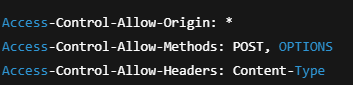

# Event Announcement App

## Overview
The Event Announcement App is a serverless, event-driven web application designed to publish event announcements and notify subscribers via email. The application follows a clean separation of concerns by using managed AWS services, eliminating the need for backend servers and manual scaling.

A static frontend hosted on Amazon S3 sends event data to a REST API exposed through Amazon API Gateway. The API triggers an AWS Lambda function that processes the request and publishes notifications to Amazon SNS.

## Architecture
  
  [architecture readme!](architecture/architecture.md) (brief description about the architecture core flow of the project)

#### Core Flow
1. A client sends an event payload to the API
2. API Gateway forwards the request to Lambda
3. Lambda validates and processes the request
4. SNS publishes a notification to subscribed emails
  

## Tech Stack
### AWS Services

 - Amazon S3 – Static website hosting
 - Amazon API Gateway – REST API
 - AWS Lambda – Serverless compute
 - Amazon SNS – Email notifications
 - AWS IAM – Access control (least privilege)
 - AWS CloudFormation – Infrastructure as Code
 

### Languages & Tools
 - Python – Lambda business logic
 - AWS CLI – Deployment & operations
 - boto3 – AWS SDK for Python
 - Git & GitHub – Version control

## How It Works
#### Frontend flow
 - Collects event details from the user
 - Sends HTTP requests to the API Gateway endpoint
 - Contains no AWS credentials or business logic  

#### Backend flow

  -API Gateway exposes a POST /create-event endpoint
  -Lambda receives the request via proxy integration
  -Request body is parsed and validated
  -A clean, dynamic email message is generated
  -SNS sends notifications to confirmed subscribers

#####  Input Validation & Error Handling
The API handles common client errors:
  -Missing request body
  -Invalid JSON
  -Missing required fields (title, date, description)

Responses follow HTTP standards:
  -200 OK → Event processed successfully
  -400 Bad Request → Invalid input

This ensures API professionalism and predictable behavior.

#### Notifications
 - Amazon SNS broadcasts event announcements to subscribed email addresses
 - The application remains unaware of subscribers, ensuring decoupling

## Infrastructure as Code
All AWS resources are defined using AWS CloudFormation templates.

[cloudformation architecture readme](architecture/cloudformation-architecture.md)

Benefits:
 - Reproducible deployments
 - Version-controlled infrastructure
 - Clear audit trail of changes
 - No manual console dependency
 - CloudFormation acts as the single source of truth for the system.

The stack includes:
  -IAM role for Lambda
  -SNS topic & subscriptions
  -Lambda function
  -API Gateway REST API

## Security Consideration
 - IAM roles follow least-privilege principles
 - Lambda can only publish to the specific SNS topic it needs
 - No AWS credentials are exposed to the frontend
 - API Gateway acts as the controlled public entry point
 - Email subscriptions require manual confirmation (SNS security model)

## Deployment (will be updated as project finishes updated due : 19 jan 2026)
This project is deployed using an infrastructure-first approach with AWS CloudFormation.
Backend services are provisioned first and validated independently before the frontend is hosted.

#### Prerequisites

-An active AWS account
-AWS CLI installed and configured
-IAM permissions to create CloudFormation stacks, Lambda, API Gateway, SNS, and S3 resources

### Step 1: Deploy Backend Infrastructure (CloudFormation)

  -All backend resources are provisioned using AWS CloudFormation.

This stack creates:

  -IAM role for Lambda (least privilege)

  -SNS topic and email subscriptions

  -Lambda function 

  -API Gateway REST API

Wait until the stack reaches CREATE_COMPLETE.

### Step 2: Confirm SNS Email Subscription

After stack creation:

  -Check your email inbox
  -Open the SNS confirmation email
  -Confirm the subscription
  -Email notifications will not be delivered until this step is completed.

### Step 3: Configure CORS for Browser Access

Since the frontend runs in a browser, Cross-Origin Resource Sharing (CORS) must be enabled to allow requests from the S3 website to the API Gateway endpoint.
This project uses Lambda proxy integration, so CORS is handled inside the Lambda function rather than in API Gateway.

##### CORS handling strategy:

The Lambda function explicitly handles OPTIONS (preflight) requests
All API responses include the required CORS headers

Example headers returned by Lambda:

##### Handling CORS at the Lambda layer ensures:

  -Compatibility with proxy integration
  -Predictable browser behavior
  -Centralized response control

### Step 4: Test Backend Independently (API Validation)

Before deploying the frontend, the backend is validated using curl:

##### Expected result:

  -HTTP 200 OK
  -Confirmation email received via SNS

### Step 5: Deploy Frontend (S3 Static Website)

The frontend is hosted using Amazon S3 static website hosting.

##### Deployment steps:

  -Create an S3 bucket with a globally unique name
  -Disable Block all public access
  -Enable Static website hosting
  -Index document: index.html

##### Upload frontend files:
index.html
script.js
styles.css

 -Apply a public read bucket policy
 -The S3 website endpoint becomes the public application URL.

### Step 6: End-to-End Application Test

Using the S3 website URL:
  -Open the application in a browser
  -Submit an event using the form

##### Expected behavior:

  -Browser request succeeds without CORS errors
  -API Gateway forwards the request to Lambda
  -Lambda validates input and publishes the message
  -SNS delivers the notification email

#### This confirms the complete flow:

### Browser → S3 → API Gateway → Lambda → SNS → Email

### Step 7: Cleanup (Optional)

To avoid unnecessary costs, the backend can be removed using:

###### aws cloudformation delete-stack --stack-name event-announcement-app
CloudFormation safely deletes all associated resources.

#### Deployment Summary

 -Backend deployed using CloudFormation

 -CORS handled at the Lambda layer for proxy integration

 -Frontend hosted on S3 static website

 -End-to-end flow tested using browser and curl

 -Fully reproducible from source control

## Design Decisions & Trade-offs (will be updated as project finishes updated due : 19 jan 2026)
### Why Serverless

 -No server management
 -Automatic scaling
 -Cost-efficient for low-to-medium traffic
 -Faster development and iteration

### Trade-offs

 -Cold starts (acceptable for this use case)
 -Stateless execution model
 -Vendor-specific services (documented and intentional)
 =Optional components such as persistence (DynamoDB) were intentionally excluded in v1 to keep the architecture minimal and focused.

## What I Learned
 - Designing serverless architectures instead of writing ad-hoc code
 - Difference between infrastructure changes vs application code changes
 - CloudFormation stack lifecycle and rollback behavior
 - Debugging real AWS deployment issues using stack events
 - API Gateway → Lambda proxy integration
 - Secure IAM policy design
 - Event-driven communication using SNS
 - Importance of input validation and error handling in APIs
 - Real-world deployment workflows (artifacts, S3, updates)

## Future Improvements (will be updated as project finishes updated due : 19 jan 2026)
 - Authentication and authorization (Cognito)
 -Persistent event storage using DynamoDB
 -Observability with CloudWatch metrics and alarms
 -API throttling and request validation
 -CI/CD pipeline for automated deployments

## Project Status
✅ v1.0 Complete
End-to-end tested using both curl and an S3-hosted frontend with real email delivery via SNS.
